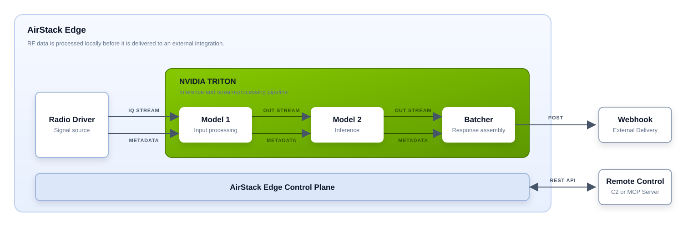

# AirStack Edge™ Model Vault

Reference and experimental [NVIDIA Triton](https://github.com/triton-inference-server/server) model
components for RF processing, radio transcription, stream processing, and signal analysis on
[AirStack Edge](https://deepwave.ai/software-products/airstack-edge/).



## What is included

This repository contains reusable Triton models and ensemble examples for turning RF inputs into
useful edge results. The source tree includes examples for IQ demodulation, speech recognition,
stateful stream processing, signal-analysis building blocks, and composed multi-stage pipelines
(ensemble models).

The models are organized by function for discovery and maintenance. A model's `config.pbtxt` and
numeric version define its deployed interface. Source directory names do not change Triton logical
model names.

## Usage and Applications

AirStack Edge is Deepwave's API software for deploying and managing RF AI application suites at the
edge. See [API Docs here](https://docs.deepwave.ai/AirStack/Edge/api_documentation). This repository
provides Triton model components for the supported AirStack Edge deployment path.

Structured edge results, such as transcripts and RF metadata, can provide useful input to downstream
RF-intelligence systems such as the
[Radio Intelligence Agent (RIA)](https://deepwave.ai/solutions/radio-intelligence-agent/).

Note: While these models may run in a stand-alone NVIDIA Triton server, AirStack Edge is the
repository's only tested deployment path.

## NVIDIA Triton in this repository

A Triton model consists of a `config.pbtxt` configuration, one or more numeric version directories,
and a selected backend. Ensemble models consist of multiple other models chained together
(pipelines). The `models/` tree is source organization, not an AirStack Edge upload package: package
each selected model's contents as an individual content-level archive without changing its
configuration or payloads.

Read [Triton Model Repository Concepts](docs/triton-concepts.md) for model repositories, versions,
backends, ensembles, and the source-to-runtime distinction.

## Quick start

### Deploy with AirStack Edge

Use the supported AirStack Edge path and follow Deepwave's official
[Triton inference application note](https://docs.deepwave.ai/AirStack/Edge/application_notes/triton-inference-server/)
and [AirStack Edge overview](https://docs.deepwave.ai/AirStack/Edge/overview/). See the repository
[deployment guide](docs/deployment.md) for the model archive and dependency requirements.

## Creating your own custom model

Use this compact structure for a new model:

```text
models/<category>/<model-directory>/
|-- README.md          # purpose, interface, backend, requirements, examples
|-- config.pbtxt       # Triton name, backend/platform, tensors, parameters
`-- <version>/         # numeric version directory
    `-- <artifact>     # model.py, model.onnx, model.pt, or backend-specific files
```

1. Choose the Triton backend.
2. Keep the tensor interface in `config.pbtxt`.
3. Put implementation artifacts in a numeric version directory.
4. Document, test, and package the model according to the repository guide.

Ensembles use the same model pattern but compose other logical model names. See the
[Model Authoring Guide](docs/model-authoring.md) for placement, interface, documentation, testing,
and packaging requirements. See the
[FM Radio ASR Pipeline](models/ensemble/fm_radio_asr_pipeline/README.md) as an example.

## Resources

- [Model categories](models/README.md)
- [Triton concepts](docs/triton-concepts.md)
- [Deployment guide](docs/deployment.md)
- [Model authoring](docs/model-authoring.md)
- [Contributing](CONTRIBUTING.md)
- [BSD-3-Clause license](LICENSE)
- [AirStack Edge](https://deepwave.ai/software-products/airstack-edge/)
