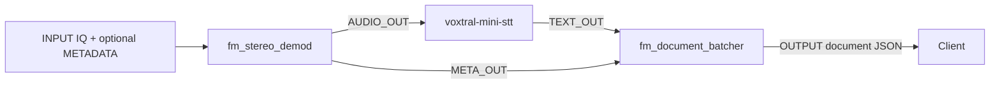

# FM Radio ASR Pipeline

Reference, decoupled Triton ensemble for turning broadcast-FM IQ samples into batched transcript documents. It is intended for the supported AirStack Edge deployment path.

## Pipeline and dependencies

`fm_stereo_demod` → `voxtral-mini-stt` → `fm_document_batcher`

All names are Triton logical model names. On AirStack Edge, upload and enable each dependency as its own content-level model archive; this source-tree layout is not itself uploadable.

## Flow

The ensemble configuration declares optional `RESET` and `FLUSH` inputs and routes them to `fm_document_batcher`. The demodulator currently returns mono audio even though its internal graph recovers stereo channels.

## Interface

| Tensor | Direction | Type and shape | Required | Meaning |
| --- | --- | --- | --- | --- |
| `INPUT` | Input | `FP32`, `[-1]` | Yes | Interleaved IQ samples. |
| `METADATA` | Input | `STRING`, `[1]` | No | Metadata passed through demodulation to document formatting. |
| `RESET` | Input | `BOOL`, `[1]` | No | Clears document-batcher state for the stream. |
| `FLUSH` | Input | `BOOL`, `[1]` | No | Emits a non-empty partial document. |
| `OUTPUT` | Output | `STRING`, `[1]` | Conditional | Compact document JSON emitted by `fm_document_batcher`. |

The ensemble is unbatched (`max_batch_size: 0`) and decoupled. On AirStack Edge, run it in `continuous` stream mode and configure at least one webhook for results. Edge supplies `INPUT` and optional `METADATA` in this workflow and ignores the optional `RESET` and `FLUSH` ensemble inputs, so documents emit only when the configured batch thresholds are reached.

## Output and limits

`OUTPUT` is the document-batcher JSON object containing `document`, `doc_index`, and `doc_metadata`. According to the checked-in batcher interface, it emits when buffered non-empty text reaches 400 characters, reaches the 2,000-character safety limit, or receives `FLUSH`; through AirStack Edge, emission is threshold-based because that optional control is ignored. Audio is currently mono: `fm_stereo_demod` recovers stereo internally but sums channels before `AUDIO_OUT`.

See [FM stereo demodulation](../../demodulation/fm_stereo_demod/README.md), [Voxtral STT](../../speech_recognition/voxtral-mini-stt/README.md), and [FM document batcher](../../stream_processing/fm_document_batcher/README.md) for stage requirements and limitations.
