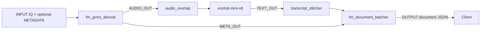

# GMRS ASR Pipeline

Reference, decoupled Triton ensemble for turning narrowband FM/GMRS IQ samples into batched transcript documents. It is intended for the supported AirStack Edge deployment path.

## Pipeline and dependencies

`fm_gmrs_demod` → `audio_overlap` → `voxtral-mini-stt` → `transcript_stitcher` → `fm_document_batcher`

`audio_overlap` retains two seconds of preceding audio and `transcript_stitcher` removes matching transcript overlap. On AirStack Edge, upload and enable every named logical model as its own content-level archive.

## Flow

The ensemble configuration declares optional controls: it routes `RESET` to `audio_overlap`, `transcript_stitcher`, and `fm_document_batcher`, and routes `FLUSH` to `fm_document_batcher`. Audio overlap is followed by transcript stitching so that repeated audio context does not normally produce repeated document text.

## Interface

| Tensor | Direction | Type and shape | Required | Meaning |
| --- | --- | --- | --- | --- |
| `INPUT` | Input | `FP32`, `[-1]` | Yes | Interleaved IQ samples. |
| `METADATA` | Input | `STRING`, `[1]` | No | Metadata carried to document formatting. |
| `RESET` | Input | `BOOL`, `[1]` | No | Resets overlap, stitching, and document state. |
| `FLUSH` | Input | `BOOL`, `[1]` | No | Emits a non-empty partial document. |
| `OUTPUT` | Output | `STRING`, `[1]` | Conditional | Compact document JSON emitted by `fm_document_batcher`. |

The ensemble is unbatched (`max_batch_size: 0`) and decoupled. On AirStack Edge, run it in `continuous` stream mode and configure at least one webhook for results. Edge supplies `INPUT` and optional `METADATA` in this workflow and ignores the optional `RESET` and `FLUSH` ensemble inputs, so documents emit only when the configured batch thresholds are reached.

## Output and limits

`OUTPUT` contains `document`, `doc_index`, and `doc_metadata`. According to the checked-in document-batcher interface, it emits at 400 buffered characters, at 2,000 characters, or on `FLUSH`; through AirStack Edge, emission is threshold-based because that optional control is ignored. The demodulator is configured for 1.92 MHz IQ and 16 kHz audio; provide interleaved real/imaginary `float32` values with an even length.

See [GMRS demodulation](../../demodulation/fm_gmrs_demod/README.md), [Voxtral STT](../../speech_recognition/voxtral-mini-stt/README.md), and [FM document batcher](../../stream_processing/fm_document_batcher/README.md). For the supported AirStack Edge workflow, use the [GMRS ASR tutorial](https://docs.deepwave.ai/AirStack/Edge/tutorials/asr_ensemble_tutorial/).
